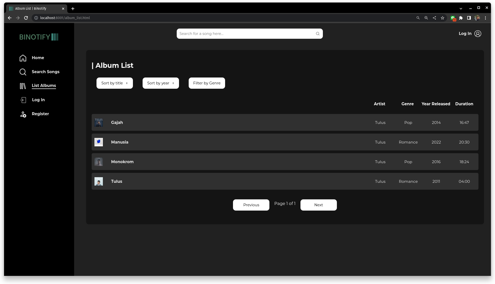
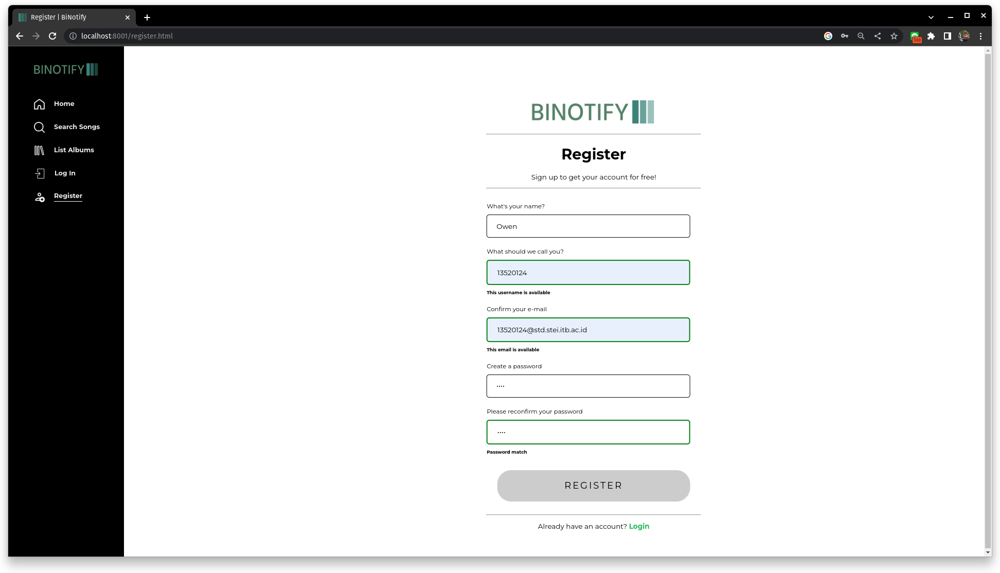
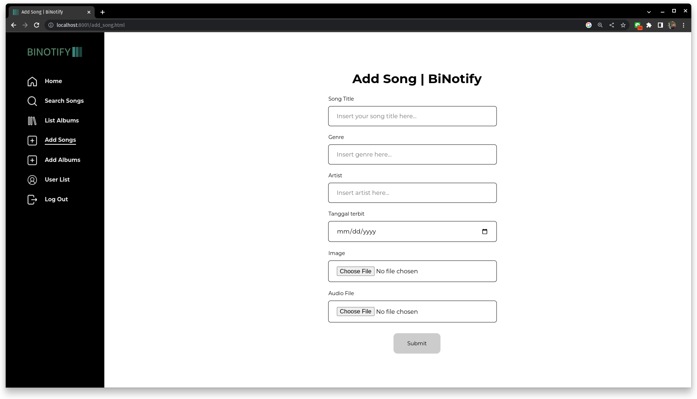
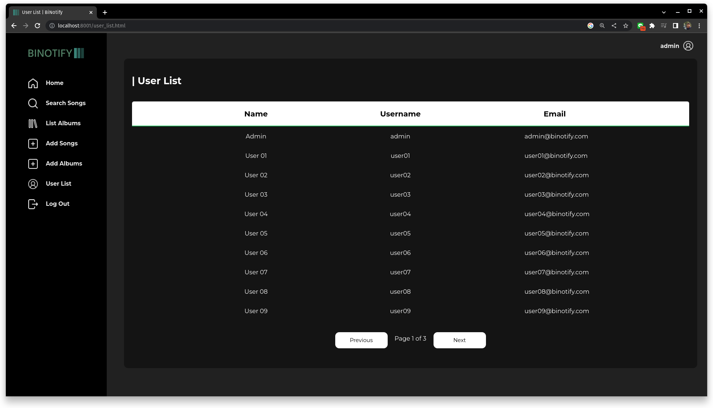
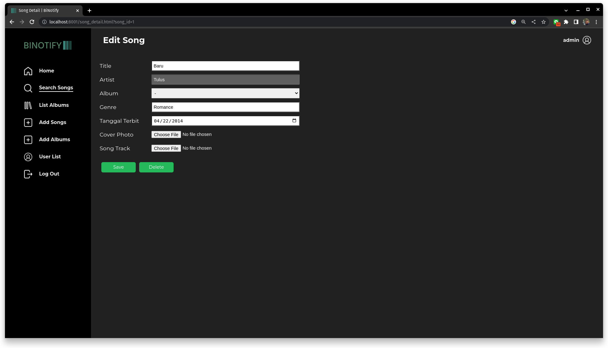

# BiNotify: Aplikasi Web Pemutar Lagu menggunakan _Monolithic PHP_ dan _Vanilla Web Application_
> Implementasi untuk Tugas Besar 1 IF3110 Pengembangan Berbasis Web, Prodi Informatika ITB Tahun Ajaran 2022/2023


## Deskripsi
BiNotify adalah sebuah aplikasi pemutar lagu berbasis web yang dapat digunakan untuk memutar lagu, menambahkan lagu / album, serta melakukan perubahan data lagu / album yang terdaftar. Pengguna dapat memutar lagu yang terdaftar di BiNotify dengan mudah menggunakan UI yang simpel dan aplikasi yang berbasis web. Menggunakan hak admin, pengguna dapat melihat daftar pengguna lainnya dan menambahkan / menyunting lagu dan album.


BiNotify dibangun menggunakan bahasa pemrograman HTML, CSS, dan JavaScript di bagian _client side_, dan PHP di bagian _server side_. Komunikasi antara kedua pihak dilakukan dengan paradigma _request/response_ secara _asynchronous_ dengan perantara AJAX. Penanganan _state_ dilakukan menggunakan fitur `$_SESSION` dari bahasa PHP. 

## Daftar _Requirement_
Perangkat lunak yang dibutuhkan untuk bisa mengoperasikan BiNotify adalah:
- Docker versi 20.10.21, <a href = "https://docs.docker.com/engine/install/">*panduan instalasi* </a>
- Docker Compose versi 1.26.2, <a href = "https://docs.docker.com/compose/install/">*panduan instalasi* </a>
- _Operating system_ berbasis _WIndows 10_ atau _Linux Ubuntu 20.04_

## Instalasi dan Pemakaian
Instalasi dapat digunakan menggunakan perintah `docker-compose` seperti berikut:
```
docker-compose down && docker-compose build && docker-compose up
```
atau menggunakan `Makefile`,
```
make down build run
```
Apabila proses instalasi berhasil,
- Aplikasi dapat diakses pada `http://localhost:8001`, dengan login dilakukan pada `http://localhost:8001/login.html` dengan kredensial berikut:
```
-- untuk user biasa
Username: user01
Password: dummy

-- untuk user admin
Username: admin
Password: admin
```
- Adminer (antarmuka basis data) dapat diakses pada `http://localhost:8080` dengan kredensial berikut:
```
Server: database-tubes-1-wbd
Username: tubes
Password: tubes
Database: tubes_wbd
```

Apabila proses instalasi tidak berhasil karena _port_ yang digunakan sedang digunakan untuk proses lain, _port_ dapat diganti pada konfigurasi `docker-compose.yml`

## _Screenshot_
### Halaman _Home_


### Halaman Daftar Lagu (_Search, Sort, dan Filter_)


### Halaman Daftar Album


### Halaman Detail Lagu
(Kasus admin, dapat melakukan editing)


### Halaman Detail Album 
(Kasus admin, dapat melakukan editing)


### Halaman Register


### Halaman Login


### Halaman Tambah Lagu (Admin)


### Halaman Tambah Album (Admin)


### Halaman Daftar User (Admin)


### Opsi Edit Lagu / Album (Admin)
(dijadikan satu kasus karena layouting yang sama)



## Pembagian Tugas
Secara umum, pembagian tugas dilakukan dengan setiap anggota melakukan pengembangan di _server side_ maupun _client side_ berdasarkan _groundwork_ yang sudah dibuat. Pengecualian terkhusus pada pembuatan komponen _reusable_ dan CSS yang digunakan bersama. 

Legenda NIM adalah sebagai berikut:
- 13520043: Muhammad Risqi Firdaus
- 13520117: Hafidz Nur Rahman Ghozali
- 13520124: Owen Christian Wijaya
### Server Side
- Halaman Login + Register: 13520124
- Halaman Home + Navbar: 13520117
- Halaman Daftar Lagu + Pagination + Search/Sort/Filter: 13520124
- Halaman Daftar Album: 13520124
- Halaman Detail Lagu + Player Lagu: 13520117
- Halaman Detail Album: 13520043
- Halaman Tambah Lagu: 13520043
- Halaman Tambah Album: 13520043
- Halaman Daftar User: 13520124

### Client Side
- Halaman Login + Register: 13520124
- Halaman Home + Navbar: 13520117
- Halaman Daftar Lagu + Pagination + Search/Sort/Filter: 13520117, 13520124
- Halaman Daftar Album: 13520117, 13520124
- Halaman Detail Lagu + Player Lagu: 13520117
- Halaman Detail Album: 13520043
- Halaman Tambah Lagu: 13520043
- Halaman Tambah Album: 13520043
- Halaman Daftar User: 13520124

